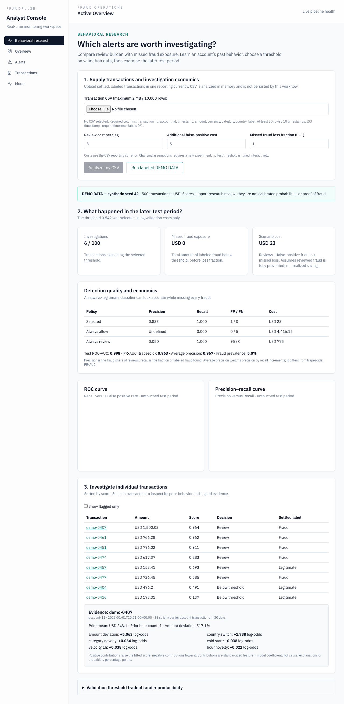

# FraudPulse

**Finding suspicious transactions is only useful when the investigation burden and missed financial loss are understood together.**

[](https://github.com/CSingh26/FraudPulse/actions/workflows/ci.yml)

FraudPulse is a transaction-risk research workspace and an operational alerting prototype. Import your own labeled transaction CSV, learn historical account behavior, select a review threshold using validation-period costs, and inspect later test transactions with individual explanations.

## The financial question

How can potentially fraudulent activity be identified without overwhelming investigators with false alarms? A classifier that allows every transaction can report 99% accuracy when fraud prevalence is 1%. It also misses every fraud. Accuracy alone hides the financial failure.

I built this to explore the tension between detection and customer friction: a higher threshold reduces reviews but can leave more exposure undetected. The relevant decision depends on transaction amounts, investigation costs and how much missed exposure becomes loss.

## What the system analyzes

- Prior-hour transaction velocity and strictly earlier 30-day account behavior.
- Amount deviation from each account's historical mean, category novelty, country transitions and UTC-hour novelty.
- A transparent logistic model fit on the earliest data; a validation-selected threshold evaluated on later untouched data.
- Precision, recall, confusion counts, ROC-AUC, trapezoidal PR-AUC, average precision and class prevalence.
- Scenario costs against always-allow and always-review baselines, plus signed evidence for individual transactions.
- Existing queue-backed transaction ingestion, alert status updates and investigation notes, preserved as a separate operational workflow.



## Example financial interpretation

An 80-unit purchase may be unremarkable for one account and unusual for another. Against a strictly earlier 20-unit average, it is 300% above baseline. Combined with new merchant behavior and a burst of transactions, that may justify investigation. It does not prove fraud. The selected policy can still miss fraud or spend more than a simple baseline; those results are shown rather than hidden.

The loss scenario is:

`review expense + additional false-positive friction + missed fraud exposure × loss fraction`

Review expense applies to every flag. The scenario assumes detected fraud is fully prevented, and it does not include platform fixed costs, investigator capacity or imperfect review. Costs are assumptions in the CSV's reporting currency, not observed business savings.

## Run the research workspace

Requires Node 20+, pnpm **9.12.0**, and Python 3.11 or 3.12. No database, account, API key or Redis is required for the CSV workflow.

```bash
corepack enable
corepack prepare pnpm@9.12.0 --activate
pnpm install --frozen-lockfile
python3.12 -m venv .venv
source .venv/bin/activate
pip install -r services/ml/requirements.txt
PYTHONPATH=services/ml AUTO_TRAIN_ON_STARTUP=false uvicorn app.main:app --port 8182
```

In another terminal:

```bash
ML_URL=http://127.0.0.1:8182 pnpm --filter @fraudpulse/web exec next dev -p 3182
```

Open [Behavioral research](http://localhost:3182/research). Upload CSV, enter costs and choose **Analyze my CSV**, or explicitly run **DEMO DATA**. Changing costs clears stale results. Invalid uploads show the error; they never switch to demo values.

CSV header:

```csv
transaction_id,account_id,timestamp,amount,currency,category,country,label
```

At least 50 rows / 10 distinct timestamps, a single reporting currency, settled 0/1 labels, unique transaction IDs and timezone-aware ISO timestamps are required. Full rules: [Data dictionary](docs/DATA_DICTIONARY.md). Download an editable synthetic template from [the local ML endpoint](http://localhost:8182/research/demo).

API example:

```bash
curl -X POST http://localhost:8182/research/demo \
  -H 'Content-Type: application/json' \
  -d '{"review_cost":2,"false_positive_cost":5,"loss_fraction":0.8}'
```

Real imports use `POST /research/analyze` with the same cost fields and a `csv` string. The service returns periods, normalized input SHA-256 and source metadata. Research requests are computed in memory; uploads and fitted research models are not persisted.

## Operational alerting workflow

The original Express/Prisma/BullMQ/Next product is retained. Start Postgres and Redis with `docker compose -f infra/docker-compose.yml up -d postgres redis`, configure the per-service `.env.example` files, then run migrations, API, worker and simulator as described in [the runbook](docs/RUNBOOK.md). Postgres uses port 5433. Simulator/seeded transactions are synthetic.

The operational `/score` model is separate from behavioral research. Auto-trained synthetic artifact versions begin `demo-`. It now uses chronological holdout, but is an uncalibrated prototype and is not automatically replaced by research. Do not interpret operational model flags as confirmed fraud or a confidence probability.

## Assumptions and limitations

CSV labels must be settled and available by the fitting/selection cutoff; availability dates are not independently verified. This is retrospective research, not a live bank evaluation. History is limited to the supplied sample and 30 days. Country changes are not impossible-travel proof; UTC hours are not local time. Thresholds are searched on a bounded validation grid. Synthetic performance does not establish real-world effectiveness.

Production identity controls, label maturity, stream state, late events, probability calibration, capacity constraints, monitoring and model approval remain future engineering work. Use locally; there is no claim that this repository is ready to autonomously block real payments. See [Methodology](docs/METHODOLOGY.md), [Model card](docs/MODEL_CARD.md) and [Architecture](docs/ARCHITECTURE.md).

## Verification

```bash
source .venv/bin/activate
pnpm test:ml
pnpm lint
pnpm typecheck
pnpm build
RUN_INTEGRATION_TESTS=true pnpm test:api  # dedicated test database only
pnpm exec playwright install chromium
pnpm test:e2e
```

Tests check hand-calculated rolling features, same-time/future exclusion, independent account histories, missing/nonfinite inputs, cost and ranking metrics, undefined ratios, test-label leakage, explanation reconstruction, API imports, PostgreSQL alert workflows and real browser uploads. Browser checks use installed Chrome locally and bundled Chromium in CI. Tests run against a dedicated database and remove test records.

The [delivery record](docs/PORTFOLIO_DELIVERY.md) reports observed checks and remaining scope. Existing history is preserved; no performance, accuracy or coverage claim is fabricated.

## Future research

How stable is the cost-selected threshold when review capacity is limited? Does a behavior model retain precision after a merchant campaign changes normal spending? How much does a chargeback maturity delay alter apparent out-of-sample quality? Those are more useful next questions than increasing model complexity without an economic reason.
